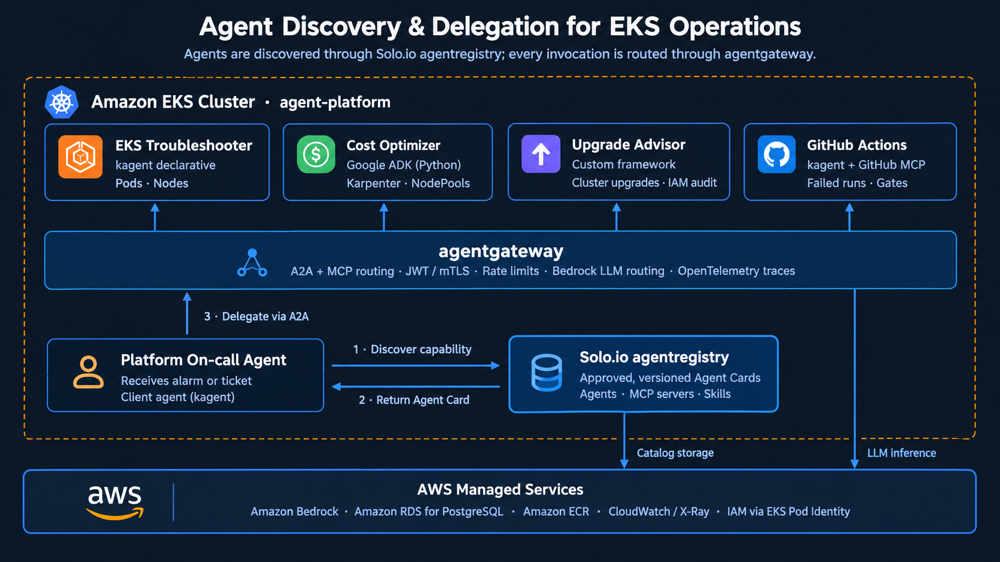
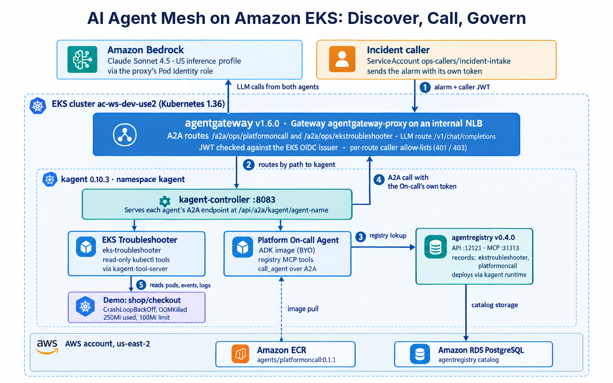

# EKS Agent Mesh with Solo.io agentregistry

An incident-response agent mesh on Amazon EKS. A **Platform On-call Agent** receives an alarm, discovers the right specialist in **agentregistry**, and calls it over **A2A** through **agentgateway**. Every model call goes through the same gateway to **Amazon Bedrock**, using EKS Pod Identity instead of stored keys.

This repo is the working pilot, run end to end on an existing EKS 1.36 cluster (us-east-2) on 2026-10-04. It includes the fixes that real run needed.

## The pattern



The On-call Agent discovers a capability in agentregistry, gets back the Agent Card, and delegates over A2A through agentgateway. The pilot ran one specialist, the EKS Troubleshooter. The Cost Optimizer, Upgrade Advisor and GitHub Actions agents show where more specialists plug in: publish one to the registry and the On-call Agent can discover it with no code change. The gateway features listed in the overview (mTLS, rate limits, OpenTelemetry traces) are agentgateway capabilities; the pilot configured JWT and caller allow-lists only.

## The pilot as built



## How one incident flows

1. The alarm reaches agentgateway with the caller's Kubernetes ServiceAccount token.
2. The gateway checks the token and routes the A2A call, by path, to the On-call Agent in kagent.
3. The On-call Agent searches agentregistry over MCP and finds `ekstroubleshooter`.
4. It calls the Troubleshooter back through the gateway, using its own ServiceAccount token.
5. The Troubleshooter reads pods, events and logs with read-only kubectl tools and returns a root cause and a fix.

## What the run showed

Each step of the discover, get card, communicate pattern, matched to evidence from [the end-to-end log](docs/pilot-logs/10-end-to-end-incident-success.log):

| Diagram step | What happened | Evidence |
| --- | --- | --- |
| Client receives a task | The incident reached the Platform On-call Agent | `route=a2a-platform-oncall … completed` |
| ① Discover | On-call queried agentregistry over MCP | `POST …agentregistry…:31313/mcp 200` |
| ② Get Agent Card | The registry returned `ekstroubleshooter` | The answer names it as the agent used |
| ③ Communicate via A2A | On-call called the Troubleshooter through agentgateway | `route=a2a-eks-troubleshooter … completed` |
| Target agent executes | The Troubleshooter used read-only kubectl tools and diagnosed OOMKilled | Root cause, evidence and fix in the reply |
| LLM | Every model call went through the gateway to Bedrock, with no keys stored | Several `route=bedrock … 200` |

Result from the real run: the demo `checkout` pods were correctly diagnosed as OOMKilled (250M allocated against a 100Mi limit), and the gateway refused unauthenticated calls (401) and calls from the wrong identity (403).

Evidence: [docs/pilot-logs/](docs/pilot-logs/) has the terminal output for each step, including the failures, and [docs/pilot-corrections-and-tests.xlsx](docs/pilot-corrections-and-tests.xlsx) lists every correction and the security test results.

## Components

| Component | Version | Role |
| --- | --- | --- |
| [agentregistry](https://github.com/agentregistry-dev/agentregistry) | v0.4.0 | Catalog of agents, MCP servers and skills; discovery over MCP; deploys agents to kagent |
| [agentgateway](https://agentgateway.dev) | v1.6.0 | Gateway API proxy for A2A, MCP and LLM traffic; JWT and CEL authorization |
| [kagent](https://kagent.dev) | 0.10.3 | Runs declarative and BYO (ADK) agents as Kubernetes resources and serves A2A |
| Amazon Bedrock | Claude Sonnet 4.5 (US inference profile) | LLM for both agents |
| Amazon RDS for PostgreSQL | db.t4g.medium | agentregistry's catalog |
| Amazon ECR | | On-call Agent image |

## Repository layout

```
docs/                       diagrams, field-tested corrections, results spreadsheet
docs/pilot-logs/            terminal output from the pilot run, in step order (masked)
infra/                      eksctl node group, IAM policy, CloudWatch add-on config
k8s/                        Gateway, Bedrock route, kagent ModelConfig, agents, routes, policies, demo workload
registry/                   agentregistry records and the On-call Deployment
agents/platformoncall/      On-call Agent code (edits on top of an arctl ADK scaffold)
scripts/                    the steps as runnable scripts, in order
```

Files containing `${VAR}` are templates: apply them with `envsubst < file.yaml | kubectl apply -f -` after sourcing `scripts/00-env.sh`.

## Prerequisites

- An EKS cluster with the EKS Pod Identity Agent and EBS CSI add-ons, and a default StorageClass
- Capacity for roughly 20 extra pods (the pilot added 2 x t3.large; see `infra/agents-nodegroup.yaml`)
- Subnets tagged `kubernetes.io/role/internal-elb=1` for the internal NLB and RDS
- Bedrock model access for the chosen Anthropic model in your region
- Local tools: aws CLI v2, eksctl, kubectl, helm, jq, envsubst, Docker with buildx

## Quick start

```bash
cp scripts/00-env.example.sh scripts/00-env.sh   # fill in your values
source scripts/00-env.sh

./scripts/01-platform.sh          # LB controller, agentgateway, kagent
./scripts/02-gateway-bedrock.sh   # internal NLB Gateway, Pod Identity, Bedrock route, ModelConfig
./scripts/03-agentregistry.sh     # RDS + agentregistry (prints how to port-forward)
./scripts/04-troubleshooter.sh    # demo workload, Troubleshooter agent, route, registry record
./scripts/05-oncall.sh            # build, publish and deploy the On-call Agent, route
./scripts/06-security.sh          # JWT + caller allow-lists
./scripts/07-test.sh              # 401 / 403 checks and the end-to-end incident
```

Run each script and check its output before the next. They mirror the commands that worked in the pilot, but your cluster may differ.

## Things that will bite you

The full list, with the fix for each, is in [docs/field-tested-corrections.md](docs/field-tested-corrections.md). The ones most likely to matter:

- **Solo.io EKS add-ons may not support the newest Kubernetes version.** Use the upstream Helm charts (done in `01-platform.sh`).
- **Restart the agentgateway proxy after creating its Pod Identity association,** or Bedrock is called with the node role.
- **arctl names allow only lowercase letters and digits.** Registry names and gateway paths are `ekstroubleshooter` and `platformoncall`.
- **Bedrock rejects a tool with an empty description,** and kagent's ADK base image drops Python docstrings. `agent.py` sets `call_agent.__doc__` explicitly.
- **The CloudWatch Observability add-on's Application Signals auto-instrumentation breaks kagent's Python runtime** (`ImportError: LogData`). Exclude the agent namespaces with `infra/cw-addon-config.json`.

## Pilot simplifications (fix before production)

- HTTP listener inside the VPC; add TLS on the Gateway.
- The JWT policy accepts any audience; use projected tokens with an `agentgateway` audience.
- Bedrock IAM allows `bedrock:InvokeModel*` on `*`; scope it to your model ARNs.
- agentregistry's API runs with its public authz provider; it is reachable only inside the cluster.
- kagent uses its bundled PostgreSQL; point it at an external database.

## Cleanup

`./scripts/99-cleanup.sh` removes everything the pilot added, except the cluster and shared components you already had.
